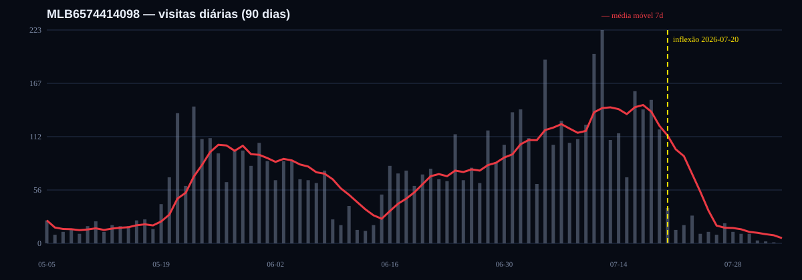
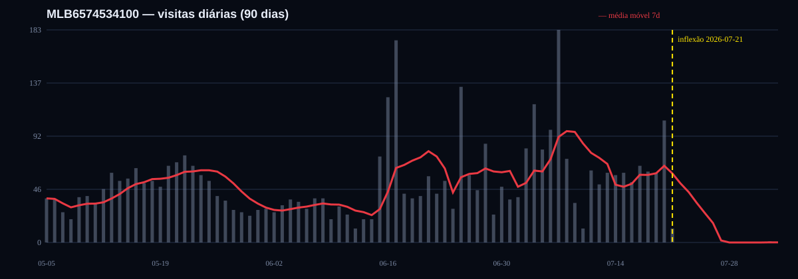

# Autópsia forense dos 2 SKUs — 2026-08-03

**Conta:** FACILYTY · account_id `1335` · seller `3058804121`  
**SKUs:** `MLB6574414098` e `MLB6574534100`  
**Modo:** estritamente read-only — somente `SELECT` e API Mercado Livre `GET`  
**Flags confirmadas:** `ML_WRITE_AUTOMATION=false` · `PREGAO_SEED=false`

## Resumo executivo

Os dois anúncios originais sofreram uma ruptura sincronizada em **20–21/07/2026**:

- `MLB6574414098`: 119 visitas em 19/07 → 37 em 20/07 → 14 em 21/07;
- `MLB6574534100`: 105 visitas em 20/07 → 12 em 21/07 → zero em 22/07.

Não foi encontrado evento de preço, status, estoque, promoção, logística, Ads, review ou pergunta capaz de explicar a ruptura nos três dias anteriores. As tabelas de histórico por item estão vazias, então a ausência de mudança histórica é registrada como **sem dado**, não como prova de que nada mudou.

A evidência mais forte disponível é uma **migração/redistribuição automática para catálogo**:

1. os dois originais são `user_product_listing`, `catalog_listing=false` e hoje respondem `status=not_listed`, `reason=item_not_opted_in` em `/price_to_win`;
2. o Mercado Livre criou sucessores de catálogo dos mesmos produtos em 30/07 e 02/08;
3. esses sucessores estão `winning`, com `visit_share=maximum`, pelo mesmo preço do original;
4. o sucessor do primeiro SKU já capturou 47 visitas em três dias e é o maior item ganhador da conta no comparativo (+6,714 visitas/dia).

**Veredito geral:** a causa mais provável é que os anúncios originais perderam distribuição durante uma transição/de-duplicação para catálogo; o mecanismo atual está confirmado, mas o gatilho exato de 20–21/07 permanece **provável, não provado**, porque não existe snapshot histórico de catálogo/status/preço nessa data.

---

# 1. MLB6574414098

## Ficha atual

| Campo | Valor |
|---|---|
| Título | Espelho Grande de Parede para Corpo Inteiro 100x40cm |
| Categoria | `MLB1641` — Espelhos |
| Preço | R$ 173,25 |
| Status / estoque | active · 108 unidades |
| Vendas acumuladas API | 17 |
| Tipo | `gold_pro` — Premium |
| Frete | grátis obrigatório |
| Logística | `xd_drop_off` · não Full/Flex |
| Catálogo original | produto `MLB76055448`, porém `catalog_listing=false` |
| Health | 0,8 no cache local; endpoint `/health/actions` devolveu 404 não aplicável |
| Ficha técnica | 34,2% completa; 49 lacunas, sendo 47 ocultas e 2 recomendadas |
| Reviews | 2 avaliações, média 5,0; zero review negativa observada |
| Perguntas | 4, todas respondidas; uma resposta em ~51h em 10–12/07 |

## Linha do tempo e inflexão



**Data de inflexão:** **20/07/2026**. O modelo de ruptura por mínimos quadrados também escolhe 20/07; a perda se consolida em 21/07.

| Data | Visitas | Observação |
|---|---:|---|
| 14/07 | 115 | ainda no patamar alto |
| 15/07 | 69 | oscilação |
| 16/07 | 159 | patamar alto |
| 17/07 | 140 | patamar alto |
| 18/07 | 150 | patamar alto |
| 19/07 | 119 | última venda paga observada, R$ 173,25 |
| **20/07** | **37** | **inflexão: -68,9% em um dia** |
| 21/07 | 14 | queda sustentada |
| 22–27/07 | 99 total | média 16,5/dia |
| 28/07–03/08 | 38 total | média 5,43/dia |

Média dos 28 dias anteriores ao corte de 21/07: **115,04 visitas/dia**. Média dos sete dias iniciados em 21/07: **16,29/dia**. Perda imediata: **98,75/dia**. O benchmark padronizado da missão anterior registrou **91,892/dia** de perda na janela 28d×7d então usada.

## O que mudou no dia ou nos três dias anteriores?

**Nenhuma mudança comercial rastreável foi encontrada.** A última venda antes da ruptura ocorreu em 19/07 a R$ 173,25, o mesmo preço atual. Não há linha em `pricing_history`, `price_adjustments`, `item_metrics_history`, promoções históricas, Ads ou logs de alteração para o SKU.

A mudança estrutural visível aparece depois: em **30/07**, o ML criou automaticamente `MLB7297087912`, catálogo do mesmo produto, mesmo preço e mesmo estoque. Esse novo ID está `winning` e tem a tag exclusiva `catalog_boost`.

## Checklist causal

| Causa | Resultado | Evidência |
|---|---|---|
| Preço subiu? | **Enfraquecida; histórico diário sem dado** | preço atual R$ 173,25; média de preço unitário em vendas pagas nos 60d pré-inflexão R$ 170,31 (+1,73%). O preço já era R$ 173,25 desde 22/06 e permaneceu assim até a venda de 19/07. Nada mudou nos três dias anteriores. |
| Promoção terminou? | **Sem dado histórico** | `original_price=null`; hoje há apenas candidaturas, nenhuma promoção ativa. `promotion_performance` e campanhas locais não têm linhas do SKU. |
| Frete grátis caiu? | **Sem dado histórico; normal hoje** | atualmente `free_shipping=true` e tag `mandatory_free_shipping`. `/shipping_options` exigiu CEP e respondeu 400 sem destino. |
| Mudou logística? | **Sem dado histórico; normal hoje** | atualmente `xd_drop_off`, não Full/Flex. Pedidos históricos são Premium e não registram Full/Flex, mas isso não reconstrói a modalidade diária. |
| Perdeu buy box/catálogo? | **Mecanismo atual confirmado; causa temporal provável** | original `not_listed/item_not_opted_in`; sucessor `MLB7297087912` é `winning`, `visit_share=maximum`, preço R$ 173,25, `price_to_win=R$ 173,00`. |
| Perdeu selo Mais vendido? | **Sem dado histórico** | tags atuais não incluem selo; nenhuma série de tags existe. |
| Health caiu? | **Sem dado histórico** | health local atual 0,8; ações API não aplicáveis; ficha técnica só 34,2%, mas sem data de queda. |
| Ficou sem estoque? | **Sem dado histórico; improvável hoje** | estoque atual 108; não existe stock history do SKU. |
| Recategorização? | **Sem dado histórico** | categoria atual `MLB1641`; não há change log. |
| Ads pausado/reduzido? | **Sem dado** | `ads_metrics_history` e `ads_campaigns_cache` têm zero linha para a conta; TACOS continua indisponível. |
| Pergunta/review negativa? | **Enfraquecida** | 2 reviews 5 estrelas; todas as perguntas respondidas. A demora de ~51h em uma pergunta ocorreu 8–10 dias antes e não explica a queda simultânea do outro SKU. |
| Sazonalidade? | **Não testável ano contra ano** | anúncio criado em 06/04/2026; não há 2025. A ruptura abrupta e simultânea em dois produtos distintos enfraquece sazonalidade normal. |

## Concorrência e efeito cascata

- O original não concorre na buy box: `item_not_opted_in`.
- O vencedor atual é da própria FACILYTY: `MLB7297087912`.
- Boosts do vencedor: `cross_docking=true`, `free_shipping=true`; faltam Full, same-day e parcelas grátis.
- Nenhum concorrente externo foi encontrado em `competitor_tracking`, `competitor_prices`, cache ou watchlist.
- O sucessor foi criado em 30/07 e obteve **9 + 21 + 17 = 47 visitas** entre 31/07 e 02/08, média **15,67/dia**.
- Nos mesmos três dias, o original recebeu 3 + 2 + 1 = 6 visitas. A família combinada fez **17,67/dia**, ainda **97,37/dia abaixo** do patamar pré-ruptura de 115,04.

### Veredito em uma frase

**O original perdeu distribuição na transição para catálogo: caiu em 20/07 sem mudança rastreável de preço/estoque, hoje está fora da competição, enquanto o sucessor automático criado em 30/07 já é vencedor e absorveu 47 visitas em três dias.**

### Plano de recuperação — não executar

| Ordem | Ação proposta | Impacto em visitas/dia | Custo/risco |
|---:|---|---|---|
| 1 | Tratar `MLB7297087912` como sucessor canônico; após aprovação, concentrar nele campanha/promoção/estoque e evitar esforço no original sem distribuição | **15,67/dia já observados e preserváveis**; teto histórico adicional de **97,37/dia**, sem promessa | médio; exige confirmar migração de campanha e não dividir tráfego |
| 2 | Abrir correção/revisão de catálogo e atributos para a família; ficha atual tem 49 lacunas | impacto **sem estimativa defensável**; teto ≤97,37/dia | baixo/médio; catálogo controla título/ficha |
| 3 | Teste controlado de uma única variável no vencedor: candidatura de 5% (R$ 164,58) por 7 dias, somente após aprovação | **0–97,37/dia** é o intervalo tecnicamente possível; não há histórico para estreitar | custo de margem; vencedor já tem share máximo, então preço não é a primeira causa |
| 4 | Avaliar Full/parcelas grátis/same-day, boosts hoje ausentes | sem dado; medir incremental antes de escalar | custo logístico/financeiro |

---

# 2. MLB6574534100

## Ficha atual

| Campo | Valor |
|---|---|
| Título | Espelho Grande de Parede 100x40 Corpo Inteiro Quarto/Closet |
| Categoria | `MLB1641` — Espelhos |
| Preço | R$ 171,53 |
| Status / estoque | active · 104 unidades |
| Vendas acumuladas API | 21 |
| Tipo | `gold_pro` — Premium |
| Frete | grátis obrigatório |
| Logística | `xd_drop_off` · não Full/Flex |
| Catálogo original | produto `MLB70347111`, porém `catalog_listing=false` |
| Health | 0,8 no cache local; `/health/actions` 404 não aplicável |
| Ficha técnica | 34,2% completa; 49 lacunas, sendo 46 ocultas e 3 recomendadas |
| Reviews | zero review disponível |
| Perguntas | 2, ambas respondidas; a de 16/07 foi respondida em ~17 minutos |

## Linha do tempo e inflexão



**Data de inflexão:** **21/07/2026**.

| Data | Visitas | Observação |
|---|---:|---|
| 14/07 | 58 | estável |
| 15/07 | 60 | última semana com vendas |
| 16/07 | 52 | última venda paga observada, R$ 171,53 |
| 17/07 | 66 | estável |
| 18/07 | 61 | estável |
| 19/07 | 60 | estável |
| 20/07 | 105 | pico imediatamente antes da ruptura |
| **21/07** | **12** | **inflexão: -88,6% em um dia** |
| 22/07–01/08 | 0 | exposição zerada |
| 02/08 | 1 | visita residual |

Média dos 28 dias anteriores a 21/07: **66,57 visitas/dia**. Média dos sete dias seguintes: **1,71/dia**. Perda imediata: **64,86/dia**. O benchmark padronizado anterior registrou **52,428/dia**.

## O que mudou no dia ou nos três dias anteriores?

Nada comercial foi registrado. O preço era R$ 171,53 desde 12/06 e continuava nesse valor na venda de 16/07. Status atual é active, estoque 104, Premium e frete grátis. Não há histórico de promoção, Ads, preço, estoque ou alteração de categoria.

O sucessor de catálogo `MLB7314817026` foi criado pelo ML em **02/08**, já como `winning`, no mesmo preço. A criação posterior mostra o canal de destino atual, mas não prova sozinha o gatilho de 21/07.

## Checklist causal

| Causa | Resultado | Evidência |
|---|---|---|
| Preço subiu? | **Enfraquecida; histórico diário sem dado** | preço atual R$ 171,53; média paga ponderada nos 60d pré-inflexão R$ 166,33 (+3,13%). O valor já era R$ 171,53 desde 12/06, 39 dias antes. |
| Promoção terminou? | **Sem dado histórico** | hoje só há candidaturas; nenhuma ativa. Há candidatos a R$ 162,95 iniciados em 28 e 31/07, ambos posteriores à queda. |
| Frete grátis caiu? | **Sem dado histórico; normal hoje** | `free_shipping=true`, obrigatório. |
| Mudou logística? | **Sem dado histórico; normal hoje** | atualmente `xd_drop_off`; pedidos permaneceram Premium e não Full/Flex. |
| Perdeu buy box/catálogo? | **Mecanismo atual confirmado; causa temporal provável** | original `not_listed`; sucessor `MLB7314817026` é `winning`, share máximo, R$ 171,53, `price_to_win=R$ 171,00`. |
| Perdeu selo Mais vendido? | **Sem dado histórico** | não há série de tags. |
| Health caiu? | **Sem dado histórico** | health local atual 0,8; ficha 34,2%, sem série. |
| Ficou sem estoque? | **Sem dado histórico; improvável hoje** | estoque atual 104; nenhuma série de estoque. |
| Recategorização? | **Sem dado histórico** | categoria atual `MLB1641`, sem change log. |
| Ads pausado/reduzido? | **Sem dado** | zero dados de Ads na conta. |
| Pergunta/review negativa? | **Enfraquecida** | zero review negativa; pergunta de 16/07 respondida em ~17 min. |
| Sazonalidade? | **Não testável ano contra ano** | criado em 06/04/2026. Ruptura de 88,6% em um dia não parece sazonalidade normal. |

## Concorrência e efeito cascata

- O original não está optado no catálogo.
- `MLB7314817026`, criado em 02/08, é o vencedor pelo mesmo preço: R$ 171,53.
- `price_to_win=R$ 171,00`; diferença de somente R$ 0,53 (0,31%).
- Outro sucessor, `MLB7313976836`, custa R$ 195,80 e está `competing`, share mínimo; é 14,5% mais caro que o preço para vencer.
- Um irmão antigo do mesmo catálogo, `MLB6654685380`, sempre teve tráfego baixo e não reproduziu o colapso; isso enfraquece uma queda de demanda do produto inteiro.
- O sucessor vencedor recebeu apenas 2 visitas em seu primeiro dia parcial. A janela é insuficiente para medir recuperação.

### Veredito em uma frase

**O SKU perdeu praticamente toda a distribuição em 21/07 sem mudança rastreável de oferta; hoje o original está fora da competição e um sucessor automático do mesmo produto/preço, criado em 02/08, passou a ocupar a posição vencedora.**

### Plano de recuperação — não executar

| Ordem | Ação proposta | Impacto em visitas/dia | Custo/risco |
|---:|---|---|---|
| 1 | Tratar `MLB7314817026` como sucessor canônico e acompanhar sete dias completos antes de qualquer preço | observação inicial **2 visitas no primeiro dia parcial**; cenário curto **2–11/dia** pela faixa observada entre início e analogia do outro sucessor; teto histórico **64,86/dia** | baixo; evita mudar preço sem diagnóstico |
| 2 | Não direcionar esforço ao duplicado caro `MLB7313976836` enquanto estiver R$ 195,80/share mínimo; revisar consolidação após aprovação | evita fragmentação; recuperação incremental **sem dado**, hoje esse ID tem zero visitas | médio; qualquer pausa/consolidação exige aprovação |
| 3 | Corrigir ficha/associação de catálogo e as 49 lacunas | sem estimativa defensável; teto ≤64,86/dia | baixo/médio |
| 4 | Somente se o vencedor não recuperar em 7 dias: teste controlado a R$ 162,95 (candidatura de 5%) | intervalo técnico **0–64,86/dia**; não há histórico de promoção para previsão menor | perda de margem; não executar sem aprovação |

---

# 3. Por que A+B não fecha com a queda total?

- Perdas A+B: **175,31 visitas/dia**.
- Queda líquida da conta: **120,57 visitas/dia**.
- Compensação esperada: **54,74 visitas/dia**.

Na amostra completa, **51 itens ganharam 54,189 visitas/dia**. Isso explica **99,0%** da diferença. O resíduo de **0,551/dia** vem de arredondamento, itens no limiar e diferença de cobertura/janela entre a série da conta e as séries por item.

| Item ganhador | Ganho/dia |
|---|---:|
| `MLB7297087912` — novo catálogo do primeiro SKU | +6,714 |
| `MLB4646267315` — kit botão francês para espelho | +6,679 |
| `MLB4435358255` — bagageiro CG160 | +5,143 |
| `MLB7275001718` — portão pet | +5,000 |
| `MLB4959509185` — portão grade pet/bebê | +4,143 |
| `MLB6574499804` — espelho 100x40 | +3,965 |
| `MLB4564072931` — guidão Titan | +2,714 |
| `MLB6574559704` — espelho 100x40 | +2,572 |
| `MLB6574535092` — espelho 100x40 | +2,358 |
| `MLB6654697330` — espelho 100x40 | +1,750 |
| Outros 41 itens | +13,151 |
| **Total** | **+54,189** |

O novo catálogo `MLB7297087912` ser o maior ganhador é evidência direta de transferência parcial de tráfego do SKU original.

---

# 4. Lacunas de dados — declaração de honestidade

Não existem linhas para os dois SKUs em:

- `item_metrics_history`;
- `seo_performance_metrics`;
- `advanced_performance_metrics`;
- `pricing_history` e `price_adjustments`;
- `promotion_performance`;
- `ads_metrics_history`/`ads_campaigns_cache` — zero linhas até no nível da conta;
- `competitor_tracking`, `competitor_prices`, watchlist e caches;
- logs de auditoria/otimização/estoque contendo os IDs.

Assim, não é possível provar diariamente preço, promoção, frete, status, logística, tags e estoque dos 90 dias. O CSV registra `sem dado` nesses campos e usa preços de transação apenas como **proxy esparso**, nunca como série de preço do anúncio.

# 5. Rastreabilidade

## APIs GET

- `/items/{id}`
- `/items/{id}/visits/time_window?last=90&unit=day`
- `/items/{id}/health/actions`
- `/items/{id}/price_to_win`
- `/reviews/item/{id}`
- `/questions/search?item={id}&limit=50`
- `/items/{id}/shipping_options` — retornou 400 sem CEP; nenhuma nova tentativa com CEP presumido
- `/seller-promotions/items/{id}?app_version=v2`
- `/products/{catalog_product_id}`
- `/items/{catalog_successor}/price_to_win`

## SELECTs

- `items`, `ml_orders`, `order_items`, `ml_questions`;
- tabelas históricas e de Ads, promoção, preço, SEO, concorrência e auditoria listadas acima;
- CSV da decomposição completa de 230 itens.

## Artefatos

- `qa/autopsia-2skus-2026-08-03/timeline-MLB6574414098.csv`
- `qa/autopsia-2skus-2026-08-03/timeline-MLB6574414098.svg`
- `qa/autopsia-2skus-2026-08-03/timeline-MLB6574534100.csv`
- `qa/autopsia-2skus-2026-08-03/timeline-MLB6574534100.svg`
- Evidência bruta sanitizada fora do docroot: `/root/qa-evidence/autopsia-2skus-2026-08-03/`

**Zero POST/PUT/PATCH/DELETE ao Mercado Livre. Os coletores forenses emitiram somente `SELECT`, sem SQL explícito de mutação.**

# 6. Tarefas menores concluídas

## P0 — Redis REPUTAÇÃO

Escuta real de **899,971 segundos** no canal `pregao`:

- 222 mensagens totais;
- 2 mensagens `op` no total;
- **1 `op` de REPUTAÇÃO**, classificado como heartbeat;
- 1 assinatura única;
- **zero evento idêntico duplicado** e zero assinatura repetida.

**Conclusão específica:** o spam de REPUTAÇÃO foi corrigido. O monitor marcou `contract_pass=false` apenas porque considerou inválida a versão dos 222 envelopes; esse achado de contrato é separado e não altera a contagem de duplicidade.

Evidência: `/root/qa-evidence/noite-2026-08-03/p0-redis-15min.json`.

## CSS — placeholder sobreposto aos candles

Raiz confirmada: `.chart-empty { display:flex }` sobrescrevia o comportamento do atributo HTML `hidden`.

Correção mínima aplicada em `public/css/pregao.css`:

```css
#pregao-root [hidden] {
    display: none !important;
}
```

Foi adicionada regressão Playwright que verifica `display:none` com `hidden` e `display:flex` quando o atributo é removido.

- RED antes da correção: esperado `none`, recebido `flex`;
- GREEN focado: 2 testes passaram;
- suíte read-only: **30 passaram, 15 ignorados, zero falha** em 21,6s;
- sem commit e sem deploy de serviços.

Logs: `/root/qa-evidence/autopsia-2skus-2026-08-03/css-red.log`, `css-green-targeted.log` e `css-green-readonly-suite.log`.
