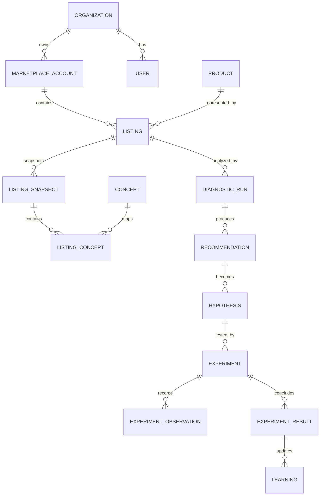

# PRD-001 — Concept Engine

**Produto:** Concept Engine
**Programa:** Plataforma de Inteligência para Marketplaces
**Empresa piloto:** Facility
**Marketplace piloto:** Mercado Livre
**Versão:** 0.1
**Status:** Em revisão
**Data:** 17/07/2026
**Responsáveis pela aprovação:** Direção do projeto, Produto, Arquitetura e Operação Marketplace
**Documentos relacionados:** Master Plan, Constituição da Plataforma, Auditoria Técnica do eSkill e ADR do eSkill como Marketplace Core

---

## 1. Resumo executivo

O Concept Engine será o módulo responsável por transformar dados de anúncios em diagnósticos, hipóteses testáveis, experimentos controlados e conhecimento acumulado.

Ele não será apenas um gerador de títulos, palavras-chave ou descrições. Seu papel será:

1. observar anúncios próprios e referências de mercado;
2. extrair conceitos, entidades, atributos e intenções;
3. identificar lacunas, repetições, inconsistências e oportunidades;
4. sugerir melhorias com evidências;
5. transformar sugestões em hipóteses;
6. controlar experimentos;
7. medir resultados;
8. registrar o aprendizado;
9. priorizar a próxima ação de maior impacto.

O produto seguirá a divisão já aprovada:

```text
eSkill coleta e executa
Concept Engine investiga e aprende
CRM organiza
Hermes coordena
Humano aprova
```

O primeiro objetivo não é “descobrir o algoritmo” do marketplace. É construir uma base própria de conhecimento por observação, comparação e experimentação.

---

## 2. Problema

A operação de marketplace possui muitos dados, mas pouco método para responder perguntas como:

- Por que um anúncio recebe visitas e não converte?
- Quais conceitos importantes estão ausentes?
- O título aproveita bem o espaço permitido?
- O campo modelo está correto ou apenas repetindo palavras?
- Quais atributos influenciam compreensão e descoberta?
- O anúncio contradiz a ficha técnica ou as imagens?
- O que diferencia os anúncios de melhor desempenho?
- Qual mudança deve ser feita primeiro?
- Uma melhoria realmente funcionou ou coincidiu com outro fator?
- O aprendizado de um anúncio pode ser reaproveitado em outros?

Hoje essas respostas tendem a ficar dispersas em planilhas, experiência individual, ferramentas externas e decisões sem histórico completo.

---

## 3. Visão do produto

Criar uma central de otimização orientada por evidências, na qual a equipe visualiza uma fila priorizada de anúncios, abre o diagnóstico de cada um, entende as lacunas, gera hipóteses, cria experimentos e acompanha o resultado.

A experiência deverá ser simples o suficiente para o uso diário e rigorosa o suficiente para evitar alterações baseadas apenas em opinião.

### Declaração de visão

> Para equipes que operam anúncios em marketplaces, o Concept Engine é uma plataforma de inteligência que identifica oportunidades, explica a evidência, organiza testes e aprende com resultados. Diferentemente de geradores genéricos de SEO, ele mantém histórico, controla variáveis e separa fato, inferência, hipótese e recomendação.

---

## 4. Objetivos

### 4.1 Objetivos principais

- Centralizar a análise dos anúncios da Facility.
- Criar um Banco de Conceitos versionado.
- Explorar os limites dos campos de forma estratégica, sem preenchimento artificial.
- Comparar anúncios próprios com grupos relevantes de referência.
- Gerar diagnósticos explicáveis.
- Criar hipóteses com prioridade, risco e confiança.
- Controlar experimentos e seus períodos.
- Medir impacto sobre indicadores de negócio.
- Construir memória histórica própria.
- Entregar tarefas ao CRM e planos ao Hermes.
- Manter aprovação humana antes de qualquer ação crítica.

### 4.2 Objetivos secundários

- Padronizar a rotina de otimização.
- Reduzir retrabalho.
- Evitar repetição de testes já realizados.
- Identificar inconsistências entre título, modelo, atributos, descrição e imagens.
- Detectar oportunidades de novos kits, variações e produtos.
- Preparar arquitetura para múltiplas lojas e marketplaces no futuro.

---

## 5. Não objetivos

O Concept Engine não deverá, no MVP:

- substituir o ERP;
- ser fonte soberana de estoque ou custo;
- armazenar tokens do Mercado Livre;
- executar scraping que contorne regras da plataforma;
- ocultar automações;
- garantir posição orgânica;
- afirmar conhecer o algoritmo interno do marketplace;
- alterar preço automaticamente;
- alterar orçamento de Ads automaticamente;
- publicar, pausar ou excluir anúncios sem aprovação;
- responder compradores automaticamente sem regra específica;
- clonar anúncios concorrentes;
- inventar atributos que o produto não possui;
- usar volume de caracteres como objetivo isolado;
- substituir o eSkill como Marketplace Core;
- substituir o CRM;
- substituir a decisão humana.

---

## 6. Escopo do MVP

### Incluído

- Facility como primeira organização.
- Uma ou mais contas Mercado Livre da Facility.
- Sincronização de anúncios próprios via eSkill.
- Lista inteligente de anúncios.
- Diagnóstico individual.
- Extração de conceitos.
- Banco de Conceitos.
- Análise de título.
- Análise de campo modelo.
- Análise de atributos e ficha técnica.
- Análise de descrição.
- Análise de imagens por presença, função e consistência.
- Comparação com grupo de concorrentes/referências.
- Entrada de concorrente por URL ou identificador.
- Cobertura semântica.
- Lacunas.
- Repetições sem ganho.
- Inconsistências.
- Aproveitamento estratégico de caracteres.
- Geração de rascunhos.
- Geração de hipóteses.
- Criação e acompanhamento de experimentos.
- Histórico de versões.
- Auditoria.
- Aprovação humana.
- Integração com CRM para tarefas.
- Integração com Hermes para priorização.

### Fora do MVP

- Falcão.
- Shopee e outros marketplaces.
- Execução autônoma irrestrita.
- Otimização automática de Ads.
- Precificação dinâmica autônoma.
- NLP antigo do eSkill como classificador de produção.
- Treinamento de modelo próprio sem dataset validado.
- Remoção automática de módulos do eSkill.
- Engenharia reversa de mecanismos internos não públicos.

---

## 7. Usuários e papéis

### 7.1 Administrador

- conecta organizações e contas;
- gerencia usuários;
- configura permissões;
- define limites de automação;
- aprova integrações;
- acessa auditoria.

### 7.2 Gestor de Marketplace

- acompanha fila inteligente;
- revisa diagnósticos;
- aprova hipóteses;
- inicia e encerra experimentos;
- prioriza ações;
- avalia resultados.

### 7.3 Analista de Conteúdo/SEO

- analisa título, modelo, descrição e atributos;
- cria rascunhos;
- valida conceitos;
- registra justificativas;
- prepara experimentos.

### 7.4 Designer/Conteúdo Visual

- recebe lacunas de imagem;
- produz e substitui ativos;
- marca função de cada imagem;
- registra versões.

### 7.5 Aprovador

- aprova ou rejeita alterações;
- define limites;
- acompanha risco e impacto;
- não precisa editar o conteúdo.

### 7.6 Visualizador

- consulta dados e resultados;
- não altera nem aprova.

### 7.7 Hermes / Agente de serviço

- consulta dados autorizados;
- consolida prioridades;
- cria tarefas e relatórios;
- não recebe tokens de marketplace;
- não executa mudanças críticas sem aprovação.

---

## 8. Princípios do produto

1. Evidência antes de recomendação.
2. Hipótese não é fato.
3. Toda recomendação explica o motivo.
4. Toda mudança relevante é auditada.
5. Toda alteração crítica exige aprovação.
6. O sistema pode recomendar “não alterar”.
7. Mais caracteres não significam automaticamente melhor conteúdo.
8. Conceitos verdadeiros e relevantes têm prioridade sobre repetição.
9. Métricas observadas não serão apresentadas como causalidade.
10. O conhecimento é versionado.
11. O modelo de IA é substituível.
12. O sistema separa coleta, análise, decisão e execução.
13. A disponibilidade real dos campos e métricas será determinada dinamicamente pela integração oficial.
14. As restrições podem variar por site, categoria, tipo de anúncio e política vigente.
15. O sistema não inventa atributos, compatibilidades, medidas ou benefícios.

---

## 9. Conceitos funcionais

### 9.1 Conceito

Unidade semântica que representa algo relevante sobre um produto ou sua intenção de compra.

Tipos iniciais:

- identidade do produto;
- categoria;
- uso;
- público;
- aplicação;
- material;
- dimensão;
- cor;
- acabamento;
- instalação;
- compatibilidade;
- segurança;
- benefício;
- diferencial;
- conteúdo da embalagem;
- garantia;
- objeção;
- condição de uso;
- ambiente;
- restrição;
- intenção de busca;
- termo de comparação.

### 9.2 Palavra-chave

Expressão textual associada a um ou mais conceitos.

O produto não será orientado apenas por palavras isoladas. Termos diferentes poderão apontar para o mesmo conceito.

### 9.3 Banco de Conceitos

Repositório versionado contendo:

- conceito canônico;
- aliases;
- tipo;
- categoria;
- site;
- produtos aos quais se aplica;
- fontes observadas;
- frequência;
- diferenciação;
- evidência histórica;
- risco de uso indevido;
- status de validação;
- confiança;
- última atualização.

### 9.4 Lacuna

Conceito relevante que não está adequadamente representado no anúncio, embora se aplique verdadeiramente ao produto.

### 9.5 Inconsistência

Contradição entre campos ou ativos.

Exemplos:

- título informa uma medida e atributo informa outra;
- descrição diz “sem furar” e manual exige furação;
- imagem mostra acessório não incluído;
- modelo contém característica inexistente.

### 9.6 Hipótese

Proposta testável de relação entre uma mudança e um resultado.

Exemplo:

> Incluir o conceito “instalação por pressão” no título e reforçá-lo em uma imagem reduzirá dúvidas sobre instalação e poderá aumentar a conversão.

### 9.7 Experimento

Teste versionado com:

- hipótese;
- variável alterada;
- condição de referência;
- período;
- métricas;
- riscos;
- critérios de sucesso;
- conclusão.

---

## 10. Fluxo principal

```mermaid
flowchart LR
    A[Sincronizar anúncios do eSkill] --> B[Fila inteligente]
    B --> C[Abrir anúncio]
    C --> D[Executar diagnóstico]
    D --> E[Extrair conceitos]
    E --> F[Identificar lacunas e inconsistências]
    F --> G[Comparar referências]
    G --> H[Gerar hipóteses]
    H --> I[Criar rascunho]
    I --> J[Aprovação humana]
    J --> K[Executar pelo eSkill]
    K --> L[Monitorar experimento]
    L --> M[Concluir]
    M --> N[Atualizar Banco de Conceitos]
    N --> B
```



---

## 11. User flows

### 11.1 Fila inteligente

1. Usuário acessa “Anúncios”.
2. Sistema exibe lista priorizada.
3. Usuário filtra por conta, produto, status, risco, oportunidade e experimento.
4. Usuário abre um anúncio.
5. Sistema mostra diagnóstico mais recente.
6. Usuário escolhe a próxima ação.

### 11.2 Diagnóstico

1. Usuário abre um anúncio.
2. Sistema carrega snapshot atual.
3. Sistema mostra data da última sincronização.
4. Usuário executa ou atualiza diagnóstico.
5. Sistema analisa campos e ativos.
6. Sistema apresenta evidências, lacunas e inconsistências.
7. Usuário aceita, corrige ou rejeita conceitos.

### 11.3 Adição de concorrente

1. Usuário informa URL ou identificador.
2. Sistema identifica site e anúncio.
3. Sistema verifica categoria e similaridade.
4. Sistema solicita confirmação quando a equivalência não for clara.
5. Anúncio entra em um conjunto de referência.
6. Sistema registra a data do snapshot.

### 11.4 Rascunho de título

1. Usuário abre “Título”.
2. Sistema mostra caracteres utilizados e limite aplicável.
3. Sistema mostra conceitos presentes, ausentes e repetidos.
4. Usuário seleciona conceitos permitidos.
5. Sistema gera opções de título.
6. Sistema exibe diff, justificativa, risco e inconsistências.
7. Usuário salva um rascunho.
8. Rascunho vai para aprovação.
9. Após aprovação, o eSkill executa a alteração.

### 11.5 Experimento

1. Usuário converte recomendação em hipótese.
2. Define uma variável principal.
3. Define período mínimo.
4. Seleciona métricas.
5. Define guardrails.
6. Solicita aprovação.
7. Sistema inicia acompanhamento.
8. Sistema registra observações.
9. Usuário encerra o teste.
10. Sistema calcula resultado e confiança.
11. Aprendizado retorna ao Banco de Conceitos.

---

## 12. Arquitetura da informação

Menu principal do Concept Engine:

```text
1. Caixa de Entrada
2. Anúncios
3. Radar de Mercado
4. Diagnósticos
5. Hipóteses
6. Experimentos
7. Aprendizados
8. Auditoria
9. Configurações
```

### Subáreas

**Caixa de Entrada**
- oportunidades;
- alertas;
- aprovações;
- experimentos ativos;
- falhas de sincronização.

**Anúncios**
- todos;
- prioritários;
- sem diagnóstico;
- com lacunas;
- em experimento;
- aguardando aprovação.

**Radar de Mercado**
- grupos de referência;
- anúncios observados;
- mudanças detectadas;
- conceitos emergentes;
- faixas de preço;
- novos entrantes.

**Diagnósticos**
- cobertura;
- título;
- modelo;
- atributos;
- descrição;
- imagens;
- inconsistências;
- prontidão operacional.

**Hipóteses**
- rascunho;
- aprovadas;
- rejeitadas;
- convertidas em experimento.

**Experimentos**
- planejados;
- ativos;
- aguardando dados;
- concluídos;
- inconclusivos;
- interrompidos.

**Aprendizados**
- conceitos;
- evidências;
- resultados por categoria;
- padrões históricos;
- decisões “não alterar”.

---

## 13. Tela 1 — Listagem inteligente de anúncios

### Objetivo

Permitir que o usuário identifique rapidamente o que deve analisar primeiro.

### Layout

```text
┌─────────────────────────────────────────────────────────────────────┐
│ Conta | Busca | Filtros | Última sincronização | Atualizar          │
├───────────────────────────────┬─────────────────────────────────────┤
│ Fila de anúncios              │ Resumo do anúncio selecionado       │
│                               │                                     │
│ [Prioridade 92] Portão Pet    │ Score de oportunidade: 92          │
│ Lacunas: 8  Hipóteses: 3      │ Diagnóstico: desatualizado          │
│ Experimento: nenhum           │ Próxima ação: revisar título        │
│                               │                                     │
│ [Prioridade 78] Espelho       │ Abas rápidas                        │
│ Lacunas: 5  Hipóteses: 1      │ Diagnóstico | Lacunas | Hipóteses  │
│                               │ Experimentos | Histórico            │
└───────────────────────────────┴─────────────────────────────────────┘
```

### Colunas ou informações

- imagem;
- título;
- SKU;
- identificador do marketplace;
- conta;
- categoria;
- status;
- score de oportunidade;
- qualidade dos dados;
- lacunas;
- inconsistências;
- hipóteses abertas;
- experimento ativo;
- visitas;
- conversão;
- margem disponível, quando autorizada;
- estoque suficiente, como sinal;
- última alteração;
- última sincronização;
- responsável;
- próxima ação.

### Filtros

- conta;
- produto;
- categoria;
- prioridade;
- tipo de lacuna;
- status;
- experimento;
- responsável;
- risco;
- dados desatualizados;
- oportunidade de título;
- oportunidade de imagem;
- oportunidade de atributo.

---

## 14. Tela 2 — Central de Otimização do anúncio

### Objetivo

Concentrar diagnóstico, rascunhos, evidências e experimentos em uma única tela.

### Cabeçalho

- imagem;
- título atual;
- identificador;
- conta;
- categoria;
- status;
- última sincronização;
- score de oportunidade;
- confiança dos dados;
- experimento ativo;
- botão “Atualizar diagnóstico”;
- botão “Comparar referências”;
- botão “Criar hipótese”.

### Abas

1. Visão geral
2. Título
3. Modelo
4. Atributos
5. Descrição
6. Imagens
7. Conceitos
8. Concorrentes
9. Hipóteses
10. Experimentos
11. Histórico
12. Auditoria

### Painel lateral fixo

- próxima ação recomendada;
- impacto estimado;
- confiança;
- risco;
- esforço;
- evidência;
- botão “Criar rascunho”;
- botão “Criar hipótese”;
- botão “Enviar para aprovação”.

---

## 15. Bloco “Explorar o limite de caracteres de forma estratégica”

### Objetivo

Aproveitar o espaço disponível apenas com conteúdo verdadeiro, relevante e não redundante.

### Comportamento

Para cada campo textual:

- mostra caracteres utilizados;
- mostra limite aplicável;
- mostra espaço restante;
- mostra conceitos cobertos;
- mostra conceitos relevantes ausentes;
- mostra termos repetidos;
- mostra clareza;
- mostra consistência;
- mostra risco de excesso;
- mostra sugestões compatíveis com o espaço.

### Exemplo visual

```text
Título
[████████████████████░░░░] 48 / limite atual

Cobertura:
✓ produto
✓ material
✓ cor
✓ aplicação
○ instalação
○ medida

Sugestão:
Adicionar “por pressão”, caso confirmado na ficha técnica.

Impacto esperado: médio
Confiança: 72%
Risco: baixo
Espaço necessário: 11 caracteres

[Gerar opções] [Criar hipótese] [Ignorar]
```

### Regras

- O limite será obtido dinamicamente ou configurado por marketplace/categoria.
- O sistema não deverá assumir um limite universal.
- O sistema poderá recomendar manter espaço livre.
- Repetição não será recompensada sem evidência.
- O campo modelo deverá refletir o modelo real.
- Conceitos incompatíveis serão bloqueados.
- O usuário verá um diff antes/depois.
- O MVP gera rascunho; não aplica automaticamente.

---

## 16. Diagnósticos obrigatórios

### 16.1 Título

- comprimento atual;
- limite aplicável;
- estrutura;
- clareza;
- identidade do produto;
- conceitos presentes;
- conceitos ausentes;
- redundância;
- termos genéricos;
- termos potencialmente enganosos;
- consistência com atributos;
- consistência com imagens;
- legibilidade;
- opções de rascunho.

### 16.2 Modelo

- valor real;
- consistência com cadastro interno;
- repetição artificial;
- termos que não pertencem ao modelo;
- possível conflito com marca, SKU ou variação;
- risco de preenchimento indevido.

### 16.3 Atributos

- preenchidos;
- obrigatórios ausentes;
- relevantes ausentes;
- inconsistentes;
- divergentes entre variações;
- impacto potencial na compreensão e filtragem;
- origem da verdade.

### 16.4 Descrição

- cobertura de conceitos;
- clareza;
- estrutura;
- objeções respondidas;
- medidas;
- instalação;
- garantia;
- conteúdo da embalagem;
- contradições;
- alegações não verificadas;
- repetição excessiva.

A contribuição da descrição para descoberta orgânica deverá ser tratada como hipótese observável, não como regra garantida.

### 16.5 Imagens

- quantidade;
- função de cada imagem;
- imagem principal;
- fundo;
- ocupação visual;
- medidas;
- instalação;
- aplicações;
- variações;
- conteúdo da embalagem;
- diferenciais;
- legibilidade;
- possíveis contradições;
- ativos ausentes.

### 16.6 Operação como sinal

- estoque;
- prazo de envio;
- reputação;
- perguntas sem resposta;
- cancelamentos;
- devoluções;
- Ads;
- preço;
- margem.

Esses dados não serão apresentados como “SEO”, mas como variáveis que podem afetar o resultado do experimento.

---

## 17. Comparador de referências

### Objetivo

Comparar padrões de anúncios relevantes sem copiar conteúdo.

### Conjunto de referência

Pode conter:

- líderes observados;
- anúncios de crescimento recente;
- anúncios da mesma faixa de preço;
- catálogo e não catálogo;
- anúncios equivalentes;
- anúncios com diferenciais específicos;
- anúncios escolhidos manualmente.

### Entrada

- URL;
- identificador;
- busca assistida;
- importação de conjunto salvo.

### Saída

- diferenças de conceitos;
- diferenças de atributos;
- cobertura;
- estrutura de título;
- quantidade e função das imagens;
- preço observado;
- prazo observado;
- promoção;
- reputação;
- perguntas recorrentes;
- mudanças detectadas;
- timestamp;
- limitações da observação.

### Regras

- Não usar “market share” quando houver apenas uma amostra.
- Identificar métricas como observadas, estimadas ou confirmadas.
- Não assumir causalidade.
- Não copiar texto protegido.
- Respeitar disponibilidade e permissões da fonte.

---

## 18. Score de oportunidade

O produto não deverá apresentar um “score do algoritmo”. O score será interno e explicável.

### Componentes iniciais

- impacto potencial;
- confiança da evidência;
- urgência;
- qualidade dos dados;
- prontidão de estoque/margem;
- esforço estimado;
- risco;
- possibilidade de mensuração.

### Fórmula inicial configurável

```text
score =
  impacto × 0,30
+ confiança × 0,25
+ urgência × 0,15
+ prontidão × 0,10
+ qualidade_dados × 0,10
+ facilidade_mensuração × 0,05
+ esforço_invertido × 0,05
```

A fórmula será calibrada com os resultados dos experimentos.

### Exibição

O usuário deverá ver:

- score final;
- componentes;
- justificativa;
- dados usados;
- data do cálculo;
- versão da regra.

---

## 19. Motor de hipóteses

### Entradas

- diagnóstico;
- conceitos;
- lacunas;
- referências;
- histórico;
- perguntas;
- métricas;
- restrições de produto;
- estoque;
- margem;
- experimentos anteriores.

### Saída obrigatória

Cada hipótese deverá conter:

- problema;
- evidência;
- mudança proposta;
- variável principal;
- impacto esperado;
- confiança;
- risco;
- esforço;
- métrica principal;
- guardrails;
- janela sugerida;
- condição para interromper;
- necessidade de aprovação.

### Exemplo

```text
Problema:
Perguntas recorrentes sobre instalação e baixa cobertura do conceito “por pressão”.

Evidência:
7 de 10 referências usam o conceito; 23% das perguntas recentes tratam de instalação.

Hipótese:
Adicionar “por pressão” ao título e incluir imagem de instalação reduzirá dúvidas
e poderá elevar a conversão.

Variável principal:
Cobertura de instalação.

Métrica principal:
Conversão.

Guardrails:
Reclamações, devoluções, margem e clareza da informação.
```

---

## 20. Laboratório de experimentos

### Tipos

- título;
- modelo;
- atributos;
- descrição;
- imagem principal;
- conjunto de imagens;
- preço, somente quando autorizado;
- promoção, somente quando autorizado;
- Ads, somente em fase posterior;
- combinação de conteúdo, apenas quando não for possível isolar uma variável e isso for explicitado.

### Metodologia

- preferir uma variável principal por vez;
- registrar condições iniciais;
- registrar sazonalidade;
- registrar mudanças externas;
- usar período mínimo;
- permitir grupo comparável quando possível;
- permitir experimento sequencial quando o marketplace não oferecer divisão simultânea;
- distinguir resultado conclusivo, inconclusivo e inválido;
- registrar rollback.

### Métricas

Conforme disponibilidade:

- impressões;
- posição observada;
- visitas;
- CTR;
- conversão;
- unidades;
- receita;
- margem de contribuição;
- perguntas;
- cancelamentos;
- devoluções;
- prazo;
- reputação;
- gasto de Ads;
- ACOS;
- ROAS;
- exposição orgânica e paga.

### Guardrails

- margem mínima;
- estoque mínimo;
- ausência de reclamação crítica;
- limite de cancelamento;
- limite de devolução;
- reputação;
- segurança da informação;
- integridade dos atributos.

---

## 21. Banco de aprendizado

### Objetivo

Transformar experiências isoladas em evidência consultável.

### Registro

- contexto;
- categoria;
- produto;
- conceito;
- mudança;
- resultado;
- período;
- métricas;
- qualidade do dado;
- confiança;
- condição externa;
- efeito positivo;
- efeito negativo;
- efeito neutro;
- aplicabilidade;
- data;
- responsável;
- versão do modelo e prompt.

### Consultas

- o que funcionou para esta categoria?
- quais conceitos aumentaram clareza?
- quais mudanças não produziram efeito?
- quais alterações pioraram conversão?
- quanto tempo foi necessário?
- em quais condições o resultado se repetiu?
- esta hipótese já foi testada?

---

## 22. API pública interna do Concept Engine

Prefixo sugerido:

```text
/api/v1
```

### Caixa de entrada

```text
GET /api/v1/inbox
GET /api/v1/inbox/summary
POST /api/v1/inbox/{item_id}/assign
POST /api/v1/inbox/{item_id}/dismiss
```

### Anúncios

```text
GET /api/v1/listings
GET /api/v1/listings/{listing_id}
POST /api/v1/listings/{listing_id}/sync
GET /api/v1/listings/{listing_id}/snapshots
GET /api/v1/listings/{listing_id}/history
```

### Conceitos

```text
POST /api/v1/listings/{listing_id}/concepts/extract
GET /api/v1/listings/{listing_id}/concepts
PATCH /api/v1/listings/{listing_id}/concepts/{concept_id}
GET /api/v1/concepts
GET /api/v1/concepts/{concept_id}
POST /api/v1/concepts/{concept_id}/validate
```

### Diagnósticos

```text
POST /api/v1/diagnostics
GET /api/v1/diagnostics/{diagnostic_id}
GET /api/v1/listings/{listing_id}/diagnostics/latest
GET /api/v1/listings/{listing_id}/coverage
GET /api/v1/listings/{listing_id}/inconsistencies
```

### Títulos e rascunhos

```text
POST /api/v1/listings/{listing_id}/title-drafts
POST /api/v1/listings/{listing_id}/model-drafts
POST /api/v1/listings/{listing_id}/description-drafts
GET /api/v1/drafts/{draft_id}
PATCH /api/v1/drafts/{draft_id}
POST /api/v1/drafts/{draft_id}/submit
POST /api/v1/drafts/{draft_id}/approve
POST /api/v1/drafts/{draft_id}/reject
```

### Referências

```text
GET /api/v1/reference-sets
POST /api/v1/reference-sets
GET /api/v1/reference-sets/{set_id}
POST /api/v1/reference-sets/{set_id}/listings
DELETE /api/v1/reference-sets/{set_id}/listings/{reference_id}
POST /api/v1/reference-listings/resolve
POST /api/v1/reference-sets/{set_id}/refresh
```

### Hipóteses

```text
GET /api/v1/hypotheses
POST /api/v1/hypotheses
GET /api/v1/hypotheses/{hypothesis_id}
PATCH /api/v1/hypotheses/{hypothesis_id}
POST /api/v1/hypotheses/{hypothesis_id}/approve
POST /api/v1/hypotheses/{hypothesis_id}/reject
POST /api/v1/hypotheses/{hypothesis_id}/convert-to-experiment
```

### Experimentos

```text
GET /api/v1/experiments
POST /api/v1/experiments
GET /api/v1/experiments/{experiment_id}
PATCH /api/v1/experiments/{experiment_id}
POST /api/v1/experiments/{experiment_id}/approve
POST /api/v1/experiments/{experiment_id}/start
POST /api/v1/experiments/{experiment_id}/pause
POST /api/v1/experiments/{experiment_id}/finish
POST /api/v1/experiments/{experiment_id}/invalidate
GET /api/v1/experiments/{experiment_id}/observations
GET /api/v1/experiments/{experiment_id}/results
```

### Aprendizados

```text
GET /api/v1/learnings
GET /api/v1/learnings/{learning_id}
GET /api/v1/learnings/search
POST /api/v1/learnings/{learning_id}/review
```

### Auditoria

```text
GET /api/v1/audit-events
GET /api/v1/audit-events/{event_id}
```

---

## 23. Exemplo de criação de diagnóstico

### Request

```json
{
  "listing_id": "internal-listing-123",
  "sections": [
    "title",
    "model",
    "attributes",
    "description",
    "images",
    "concepts",
    "references"
  ],
  "reference_set_id": "refset-001",
  "force_new_snapshot": false
}
```

### Response

```json
{
  "diagnostic_id": "diag-20260717-001",
  "status": "queued",
  "listing_id": "internal-listing-123",
  "snapshot_id": "snap-20260717-083000",
  "created_at": "2026-07-17T08:30:00-03:00"
}
```

---

## 24. Exemplo de recomendação

```json
{
  "recommendation_id": "rec-001",
  "listing_id": "internal-listing-123",
  "type": "title_concept_gap",
  "priority": 91,
  "problem": "O conceito de instalação está ausente no título.",
  "evidence": [
    {
      "source": "buyer_questions",
      "description": "23% das perguntas recentes tratam de instalação."
    },
    {
      "source": "reference_set",
      "description": "7 de 10 referências utilizam um conceito de instalação."
    }
  ],
  "suggestion": "Adicionar 'por pressão', após validação técnica.",
  "required_truth_check": true,
  "expected_impact": "medium",
  "confidence": 0.72,
  "risk": "low",
  "characters_required": 11,
  "allowed_actions": [
    "create_draft",
    "create_hypothesis",
    "dismiss"
  ]
}
```

---

## 25. Eventos

```text
listing.snapshot.created
listing.metrics.observed
listing.diagnostic.requested
listing.diagnostic.completed
concept.extracted
concept.validated
concept.gap.detected
inconsistency.detected
recommendation.created
draft.created
draft.approval.requested
draft.approved
hypothesis.created
hypothesis.approved
experiment.created
experiment.started
experiment.observation.recorded
experiment.completed
experiment.invalidated
learning.updated
change.execution.requested
change.executed
change.failed
```

### Regras

- eventos idempotentes;
- identificador único;
- organization_id;
- account_id;
- listing_id;
- correlation_id;
- timestamp;
- schema versionado;
- sem tokens;
- sem segredos.

---

## 26. Integrações

### 26.1 eSkill

Responsável por:

- OAuth;
- tokens;
- chamadas ao marketplace;
- anúncios;
- perguntas;
- pedidos;
- métricas disponíveis;
- webhooks;
- execução aprovada.

O Concept Engine não acessará tokens.

### 26.2 ERP

Responsável por:

- SKU;
- estoque;
- custo;
- margem;
- disponibilidade;
- conteúdo real do produto;
- fonte de verdade para características definidas pela empresa.

### 26.3 CRM

Receberá:

- tarefas;
- responsáveis;
- aprovações;
- prazos;
- observações;
- resultado das ações.

### 26.4 Hermes

Consumirá:

- fila;
- diagnósticos;
- hipóteses;
- experimentos;
- aprendizados;
- alertas.

Poderá:

- consolidar plano diário;
- criar tarefas;
- resumir evidências;
- sugerir prioridade.

Não poderá executar ação crítica sem política e aprovação.

### 26.5 AI Gateway

Responsável por:

- seleção de modelos;
- fallback;
- custo;
- limite;
- log;
- versão;
- schema de saída;
- segurança;
- rastreabilidade.

---

## 27. Modelo de dados conceitual

### Entidades principais

```text
organizations
users
organization_memberships
marketplace_accounts
products
product_variants
listings
listing_snapshots
listing_metrics
listing_assets
concepts
concept_aliases
listing_concepts
concept_evidence
reference_sets
reference_listings
diagnostic_runs
diagnostic_findings
inconsistencies
recommendations
drafts
hypotheses
experiments
experiment_variants
experiment_observations
experiment_results
learnings
approvals
tasks
model_runs
prompt_versions
audit_events
```

### Relacionamentos principais



---

## 28. Pipeline de inteligência

```text
1. Ingestão
2. Normalização
3. Validação de origem
4. Extração de entidades
5. Extração de conceitos
6. Canonicalização
7. Deduplicação
8. Verificação de aplicabilidade
9. Verificação de consistência
10. Comparação
11. Detecção de lacunas
12. Geração de hipótese
13. Priorização
14. Aprovação
15. Experimento
16. Medição
17. Aprendizado
```

### Controles obrigatórios

- saída estruturada;
- validação por schema;
- referência à evidência;
- bloqueio de especificação inventada;
- registro do modelo;
- versão do prompt;
- custo;
- duração;
- revisão humana quando necessário.

---

## 29. Requisitos de segurança

- Isolamento por organização.
- Autorização por função e capability.
- Nenhum token de marketplace no frontend.
- Nenhum token no Concept Engine.
- Segredos apenas em backend seguro.
- Auditoria de leitura e escrita crítica.
- Aprovação separada da autoria quando aplicável.
- RLS no banco da nova plataforma.
- Logs sem credenciais.
- Criptografia em trânsito.
- Proteção contra IDOR.
- Idempotência.
- Rate limit.
- Validação de URL.
- Validação de payload.
- Proteção contra prompt injection em conteúdo externo.
- Sanitização de texto de concorrentes e perguntas.
- Registro de origem.
- Política de retenção.
- Backup e restore testados.

---

## 30. Requisitos não funcionais

### Disponibilidade

- leitura e diagnóstico deverão continuar disponíveis mesmo que uma integração externa esteja temporariamente indisponível;
- dados desatualizados deverão ser claramente marcados.

### Performance

- listagem com paginação;
- diagnósticos assíncronos;
- cache de snapshots;
- atualização incremental;
- tarefas pesadas em fila.

### Escalabilidade

- multiempresa desde o modelo de dados;
- múltiplas contas;
- processamento distribuído;
- eventos versionados;
- limites por organização.

### Observabilidade

- logs estruturados;
- métricas;
- traces;
- fila;
- dead-letter;
- dashboards;
- alertas;
- correlação entre diagnóstico, hipótese, experimento e execução.

### Auditabilidade

- toda recomendação deve ser reproduzível;
- toda alteração deve registrar antes/depois;
- todo modelo e prompt deve possuir versão;
- todo experimento deve possuir conclusão.

---

## 31. Estados do sistema

### Diagnóstico

```text
queued
processing
completed
failed
stale
```

### Rascunho

```text
draft
submitted
approved
rejected
executed
execution_failed
superseded
```

### Hipótese

```text
draft
under_review
approved
rejected
converted
archived
```

### Experimento

```text
planned
awaiting_approval
approved
active
paused
completed
inconclusive
invalidated
cancelled
```

---

## 32. Estados de interface

Cada tela deverá tratar:

- carregando;
- vazio;
- sem permissão;
- erro;
- dados desatualizados;
- sincronização em andamento;
- diagnóstico em andamento;
- integração desconectada;
- sem referências;
- sem dados suficientes;
- aguardando aprovação;
- experimento ativo;
- experimento inconclusivo;
- falha de execução.

---

## 33. Métricas de produto

- tempo médio para abrir e entender um diagnóstico;
- percentual de anúncios com mapa de conceitos;
- percentual de conceitos validados;
- recomendações aceitas;
- recomendações rejeitadas;
- hipóteses convertidas em experimento;
- experimentos concluídos;
- experimentos inconclusivos;
- tempo entre alerta e ação;
- uso da fila inteligente;
- taxa de recomendação “não alterar” aceita;
- percentual de recomendações com evidência completa;
- percentual de ações com auditoria completa.

---

## 34. Métricas de negócio

Conforme disponibilidade e autorização:

- visitas orgânicas;
- conversão;
- unidades vendidas;
- receita;
- margem;
- participação orgânica observada;
- perguntas;
- tempo de resposta;
- cancelamentos;
- devoluções;
- reputação;
- estoque;
- prazo;
- CTR;
- ACOS;
- ROAS;
- vendas orgânicas e pagas.

O sistema deverá mostrar associação temporal e resultado do experimento, sem apresentar correlação como causalidade definitiva.

---

## 35. Critérios de aceite do MVP

### Listagem

- [ ] Usuário visualiza anúncios sincronizados da Facility.
- [ ] Usuário filtra e ordena por prioridade.
- [ ] O sistema informa data da última sincronização.
- [ ] Nenhum dado de outra organização aparece.

### Diagnóstico

- [ ] Usuário executa diagnóstico.
- [ ] Diagnóstico diferencia fato, observação, inferência e hipótese.
- [ ] O sistema mostra evidências.
- [ ] O sistema não inventa atributos.
- [ ] O sistema detecta inconsistências.

### Limite de caracteres

- [ ] O sistema mostra uso atual e limite aplicável.
- [ ] O limite é configurável/dinâmico.
- [ ] Sugestões respeitam o limite.
- [ ] Sugestões evitam repetição desnecessária.
- [ ] O sistema pode recomendar não preencher o espaço restante.

### Conceitos

- [ ] Conceitos são agrupados por tipo.
- [ ] Usuário valida ou rejeita conceitos.
- [ ] Aliases apontam para conceito canônico.
- [ ] Conceitos possuem evidência.

### Concorrentes

- [ ] Usuário adiciona referência por URL ou identificador.
- [ ] Sistema registra snapshot e data.
- [ ] Sistema informa limitações da comparação.
- [ ] O sistema não apresenta amostra como participação real de mercado.

### Hipóteses e experimentos

- [ ] Recomendação pode virar hipótese.
- [ ] Hipótese possui variável principal.
- [ ] Experimento possui período e métricas.
- [ ] Alteração crítica exige aprovação.
- [ ] Resultado atualiza o aprendizado.
- [ ] Experimento pode ser marcado como inconclusivo.

### Auditoria

- [ ] Toda recomendação registra modelo, prompt e evidência.
- [ ] Toda aprovação registra usuário.
- [ ] Toda execução registra antes/depois.
- [ ] Nenhum segredo aparece nos logs.

---

## 36. Roadmap funcional

### Fase 0 — Fundação

- contratos com eSkill;
- modelo de dados;
- organizações;
- permissões;
- snapshots;
- auditoria;
- AI Gateway;
- observabilidade.

### Fase 1 — Observação

- listagem;
- sincronização;
- diagnóstico;
- conceitos;
- lacunas;
- inconsistências;
- referências;
- sem execução.

### Fase 2 — Rascunhos

- títulos;
- modelo;
- atributos;
- descrição;
- imagens;
- aprovação;
- diff;
- histórico.

### Fase 3 — Experimentos

- hipóteses;
- planos;
- períodos;
- observações;
- resultados;
- aprendizado.

### Fase 4 — Priorização

- score de oportunidade;
- caixa de entrada;
- plano diário;
- integração CRM;
- Hermes.

### Fase 5 — Execução assistida

- execução via eSkill;
- feature flags;
- limites;
- rollback;
- aprovação;
- canário.

### Fase 6 — Escala

- Falcão;
- múltiplas contas;
- outras categorias;
- outros marketplaces;
- modelos calibrados;
- automações adicionais.

---

## 37. Dependências

- estabilização de segurança do eSkill;
- API interna do eSkill;
- inventário de módulos;
- integração ERP;
- definição de organizações;
- definição de roles;
- acesso autorizado às métricas;
- estratégia de snapshots;
- definição do AI Gateway;
- servidor de contexto;
- GitHub e CI;
- ambiente de homologação.

---

## 38. Riscos

### Dados insuficientes

Mitigação:
- mostrar confiança;
- permitir “dados insuficientes”;
- não forçar conclusão.

### Métricas indisponíveis

Mitigação:
- capability matrix por conta;
- fallback para métricas internas;
- transparência.

### Confusão entre correlação e causa

Mitigação:
- metodologia;
- variável principal;
- períodos;
- observações externas;
- classificação inconclusiva.

### Sugestão falsa

Mitigação:
- verdade do ERP;
- validação humana;
- schema;
- evidência obrigatória;
- bloqueio de campos sensíveis.

### Excesso de complexidade

Mitigação:
- fila inteligente;
- próxima ação;
- progressive disclosure;
- telas por função;
- MVP restrito.

### Dependência de fornecedor de IA

Mitigação:
- AI Gateway;
- modelos substituíveis;
- prompts versionados;
- avaliação por tarefa.

### Automação indevida

Mitigação:
- modo observação;
- feature flags;
- aprovação;
- limites;
- auditoria;
- rollback.

---

## 39. Questões em aberto

1. Qual será o contrato definitivo entre eSkill e Concept Engine?
2. Quais métricas estão disponíveis por conta e categoria?
3. Quais campos possuem limites variáveis?
4. Como serão selecionadas as referências iniciais?
5. Qual ERP será fonte de produto, estoque e custo?
6. Qual é a matriz de papéis?
7. Qual período mínimo será adotado para cada tipo de experimento?
8. Como separar efeito orgânico e pago?
9. Quais informações de concorrentes podem ser observadas de forma autorizada?
10. Qual política de retenção dos snapshots?
11. Quais produtos da Facility formarão o piloto?
12. Quem aprova título, imagem, preço e Ads?
13. Qual modelo de cálculo de margem será usado?
14. Qual tecnologia final do backend do Concept Engine?
15. O frontend será iniciado no Lovable e sincronizado ao GitHub ou criado diretamente no repositório?

---

## 40. Recomendação técnica inicial

Sem transformar esta seção em decisão arquitetural definitiva, o desenho recomendado é:

```text
Frontend:
React + TypeScript

Concept Engine API:
serviço separado, orientado a contratos

Dados:
PostgreSQL
extensão vetorial quando necessária

Fila:
Redis ou serviço compatível

Integração:
API interna + eventos

IA:
AI Gateway multimodelo

Marketplace:
eSkill como Marketplace Core

ERP:
fonte soberana de estoque, custo e produto

CRM:
tarefas, responsáveis e aprovações

Hermes:
orquestração e plano estratégico
```

A tecnologia definitiva deverá ser registrada em ADR específico.

---

## 41. Próximos documentos

1. `USER_FLOWS_CONCEPT_ENGINE_V1.md`
2. `INFORMATION_ARCHITECTURE_CONCEPT_ENGINE_V1.md`
3. `WIREFRAMES_CONCEPT_ENGINE_V1.md`
4. `API_CONTRACT_CONCEPT_ENGINE_V1.yaml`
5. `DATA_MODEL_CONCEPT_ENGINE_V1.md`
6. `EXPERIMENTATION_METHOD_CONCEPT_ENGINE_V1.md`
7. `AI_GOVERNANCE_CONCEPT_ENGINE_V1.md`
8. `ADR-CONCEPT-ENGINE-ARCHITECTURE.md`

---

## 42. Aprovação

Para aprovar a versão 1.0, os responsáveis deverão validar:

- escopo;
- papéis;
- fluxo;
- telas;
- endpoints;
- limites de autonomia;
- critérios de aceite;
- integração com eSkill;
- integração com ERP;
- metodologia de experimentos;
- requisitos de segurança;
- roadmap.

### Status atual

**Versão 0.1 — Em revisão.**
